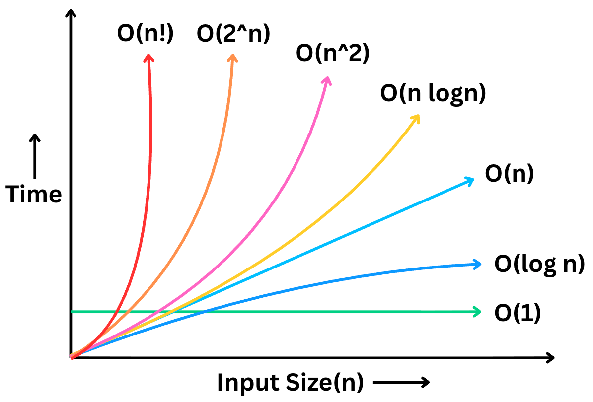

# What are algorithms?

Algorithms are just step-by-step procedure to solve a problem.

# Difference between Algorithms and Programs

**Algorithms** are created during design time whereas **Programs** are written during implementation time. Further, programming knowledge is needed to write a program, whereas to design an algorithm for any specific domain/field, knowledge of that domain is required.

# What is Priori Analysis and Posteriori Analysis?

**Priori** analysis is done for algorithms. It is theoritical analysis and uses **Time and Space** function. **Posteriori** analysis, on the other hand, is done for programs. It is implementational analysis and observe actual time and bytes used by program.

# Frequency Count Method

## Example I

```c
//'A' is an array of size 'n'
Sum(A, n) {
    s = 0; // this runs 1 time
    for (i = 0; i < n ; i++) { // this runs (n + 1) times
        s = s + A[i] // this runs n times
    }
    return // this runs 1 time
}  
```
In above example, **time function f(n)** will be:

$$
\begin{aligned}
f(n) &= 1 + (n + 1) + n + 1 \\
f(n) &= 2n + 2 \\
f(n) &= 2(n + 1)
\end{aligned}
$$

Now, what is the highest degree of the above equation?

It's $\mathbf{n^1}$

Therefore, time function here is ***order of n***

$\mathbf{f(n) = O(n)}$

Now, what will be the **space function s(n)** will be:

Let's see what space all the variables in the function:

$$
\begin{aligned}
&A \longrightarrow n \\
&\text{Why? } \rightarrow \text{because A is an array of size n} \\
&n \longrightarrow 1 \\
&s \longrightarrow 1 \\
&i \longrightarrow 1 \\
\end{aligned}
$$

Adding all, we get $n + 3$

What is the highest degree of the above equation?

It's again $\mathbf{n^1}$

Therefore, space function here is ***order of n***

$\mathbf{s(n) = O(n)}$

---

## Example II

```c
// A, B are matrices of size n x n each
Sum(A,B, n) {
    for (i = 0; i < n; i++) { // this runs (n + 1) times
        for (j =0; j < n; j++) { // this runs n * (n + 1) times
            C[i, j] = A[i, j] + B[i, j] // this runs n * n times
        }
    }
}
```

Here, **time function f(n)** will be:

$$
\begin{aligned}
f(n) &= (n + 1) + n * (n + 1) + n * n \\
f(n) &= 2n^2 + 2n + 1 \\
\end{aligned}
$$

Highest degree of the above equation?

It's $\mathbf{n^2}$

Therefore, time function here is ***order of***  $\boldsymbol{n^2}$

$\mathbf{f(n) = O(n^2)}$

The **space function s(n)** here will be:

$$
\begin{aligned}
&A \longrightarrow n^2 \\
&B \longrightarrow n^2 \\
&C \longrightarrow n^2 \\
&\text{Why? } \rightarrow \text{because A, B and C are matrices of size n x n each} \\
&n \longrightarrow 1 \\
&i \longrightarrow 1 \\
&j \longrightarrow 1 \\
\end{aligned}
$$

Adding all, we get $3n^2 + 3$

The highest degree of the above equation?

It's again $\mathbf{n^2}$

Therefore, space function here is ***order of***  $\boldsymbol{n^2}$

$\mathbf{s(n) = O(n^2)}$

---

## Example III

```c
Multiple(A, B, n) {
    for (i = 0; i < n; i++) { // (n + 1)
        for (j = 0; j < n; j++) { // n * (n + 1)
            C[i, j] = 0 // n * n
            for (k = 0; k < n; k++) { // n * n * (n + 1)
                C[i, j] = C[i, j] + A[i, k] * B[k, j] // n * n * n
            }
        }
    }
}
```

**Time function** $f(n) = 2n^3 + 3n^2 + 2n + 1$

Here, highest order is $\mathbf{n^3}$

There, time function here is ***order of***  $\mathbf{n^3}$

$\mathbf{f(n) = O(n^3)}$

**Space function** $s(n) = 3n^2 + 4$

Therefore, space function here is ***order of***  $\mathbf{n^2}$

$\mathbf{s(n) = O(n^2)}$

$\rightarrow \text{We can see that Time Complexity depends on the loops. Simple loops executing n times will have time complexity of order of n.}$

Let's explore more loops and their time functions in detail.

---

## 1. Loops incrementing/decrementing by a constant

Any loop wchich increment or decrement by a constant - no matter what that constant is (i.e., i += 2 or i+=200 or i -= 100), has the time complexity of **order of n**.

example:

```c
for (i = 0; i < n i = i + 20) {
    // some execution... // this will run for n/20 times
}
```
**Time function** $f(n) = n/20$

The highest degree is still **n**

Therefore, $\mathbf{f(n) = O(n)}$

---

## 2. Standard Nested Loops

Nested loops where all the loops run for **n** times will have time complexity of **order of** $\mathbf{n^n}$

For example, if there are three loops nested inside each other, and each one of them are running for n times, then the time complexity for such loop will be of **order of** $\mathbf{n^3}$. (See Example III from above).

## 3. Nested Loops with Dependent Variables

Example:

```c
for (i = 0; i < n; i++) {
    for (j = 0; j < i; j++) { // here j depends on i
        //something...
    }
}
```

Let's trace this loop:

| Iteration | i | j | execution |
| :---: | :---: | :---: | :---: |
| 1st | 0 | 0 ❌  | 0 |
| 2nd | 1 | 0 ✅  | 1 |
| | | 1 ❌  | |
|3rd | 2 | 0 ✅  | 2|
| | | 1 ✅  | |
| | | 2 ❌  | |
| 4th | 3 | 0 ✅  | 3|
| | | 1 ✅  | |
| | | 2 ✅ | |
| | | 3 ❌  | |
| nth | n | | n |

Let's add all the executions:

$$
\begin{aligned}
&f(n) = 1 + 2 + 3 + 4 + ... + n
&f(n) = n(n + 1)/2
&f(n) = (n^2 + n)/2
\end{aligned}
$$

The highest order here is $\mathbf{n^2}$

Therefore, time complexity if of **order of** $\mathbf{n^2}$

$\mathbf{f(n) = O(n^2)}$

---

## 4. Variable Condition Loops

Loops where condition depends on a variable being updated, time complexity is determined by finding when that variable exceeds the limit (n).

Example:

```c
p = o;
for (i = 1; p <= n ; i++) { // loop depends on the p being less than n
    p = p + i; // p is updated on every execution
}
```

Let's trace this:

| i | p |
| :---: | :---: |
| 1 | 0 + 1 |
| 2 | 1 + 2 |
| 3 | 1 + 2 + 3 |
| 4 | 1 + 2 + 3 + 4 |
| . | ... |
| . | ... |
| k | 1 + 2 + 3 + 4 + ... + k |

$$
\begin{array}{l}
\text{We get, } p = \frac{k(k + 1)}{2} \\\\
\text{Now, let's assume } p > n \\\\
\text{Why? } \rightarrow \text{ Because the loop will terminate when } p \ge n \\\\
\text{We know that } p = \frac{k(k + 1)}{2} \\\\
\text{Therefore, } \frac{k(k + 1)}{2} > n \\\\
k^2 > n \\\\
k > \sqrt{n}
\end{array}
$$

Hence $\mathbf{f(n) = \sqrt{n}}$

---

## 5. Loops where counter variable is multiplied by a factor

Example:

```c
for (i = 1; i < n; i = i * 2) {
    // statement
}
```

Tracing this:

| i |
| :---: |
| $1$ |
| $1 * 2 = 2$ |
| $2 * 2 = 2^2$  |
| $2^2 * 2 = 2^3$ |
| . |
| . |
| $2^k$ |

This loop will terminate when $i >= n$

We know that, $i = 2^k$

Therefore, $2^k >= n$

$2^k = n$

Hence, $k = \log_2 n$

Thus, $f(n) = O(\log n)$

NOTE:- When $f(n)$ is log, we may get a float value. In such case we should use **ceil** of float.

---

## 6. Loops where counter variable is divided by a factor

Example:

```c
for ( i = n; i >= 1; i = i/2) {
    //statement
}
```

Let's trace:

| i |
| :---: |
| $n$ |
| $n/2$ |
| $n/2^2$  |
| $n2^3$ |
| . |
| . |
| $n/2^k$ |

Assume $i < 1$

$n/2^k < 1$

$n = 2^k$

$k = \log_2 n$

Thus, $f(n) = O(\log n)$

---

## 7. Outer loop is Linear, inner loop is Logarithmic

Example:

```c
for ( i= 0; i < n; i ++) { // linear loop runs for n times
    for (j = 1; j < n; j = j * 2) { // logarithmic loop runs for log n times
        //statement...    // this will run for (n * log n) times
    }
}
```

Therefore, $f(n) = n\log n$

---

## Summary

**-> If the counter variable of a loop is incremented/decremented by any factor (that factor can be 1, 2, or 2000 - doesnt matter), then the time complexity will be O(n).**

Examples:

```c
for (i = 0; i < n; i++)

for (i = 0; i < n; i = i + 20)

for (i = n; i > 1; i--)

for (i = n; i > 1; i = i - 2000)
```

**-> If the counter variable of a loop is multiplied/divided by any factor (that factor can be 1, 2, or 2000 - doesnt matter), then the time complexity will be O(log n).**

Examples:

```c
for (i = 1; i < n; i = i * 2)

for (i = n; i > 1; i = 1 / 10)
```

---

# Classes of Functions

## Constant $O(1)$

- Constant time complexity means the execution time does not depend on the input size (n) and can have any constant value (eg, 1, 2, 10, 20000).

## Logarithmic $O(\log n)$

- When the counter variable is multiplied or divided by any factor.
- Base of log does not matter.

## Linear $O(n)$

- When the degree of the polynomial is 1.

## Quadratic $O(n^2)$

- When the degree of the polynomial is 1.

## Cubic $O(n^3)$

- When the degree of the polynomial is 3.

## Exponential $O(2^n)$

- Can be $3^n$, $4^n$ etc..

---

# Comparison of Functions



$
\Large 
\begin{array}{l}
1 < \log n < \sqrt{n} < n < n \log n < n^2 < n^3 . . . < 2^n . . . < n^n
\end{array}
$

-> For smaller values of $n$, the value of $2^n$ can be smaller than or equal to $n^k$, but as tge value of $n$ increases, value of $2^n$ increases exponentially.

---